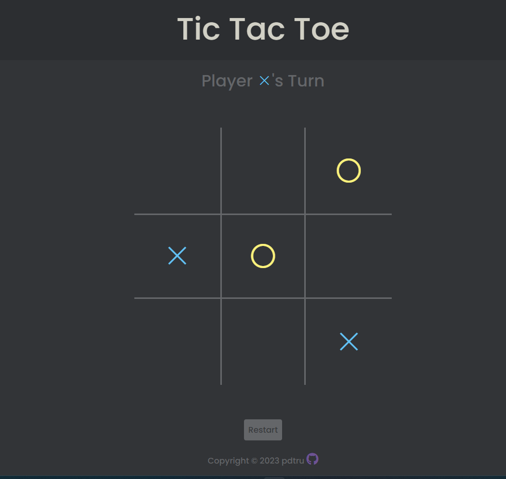

 

  <h1 align="center">Tic Tac Toe</h1>

  

    A simple Tic Tac Toe game
     
     
    <a href="https://pdtru.github.io/tic-tac-toe/">View Demo</a>
     
     
    
  

## Built With

- 
- 
- 

## Contact

Peter Tran-Truong - petertrantruong@gmail.com

Project Link: [https://github.com/pdtru/tic-tac-toe](https://github.com/pdtru/tic-tac-toe)

## Acknowledgments

- [Markdown Badges](https://ileriayo.github.io/markdown-badges/#usage)
- [Font Awesome](https://fontawesome.com/)
- [Icons8](https://icons8.com/)
- [Google Fonts](https://fonts.google.com/)
- [Material UI](https://materialui.co/)
